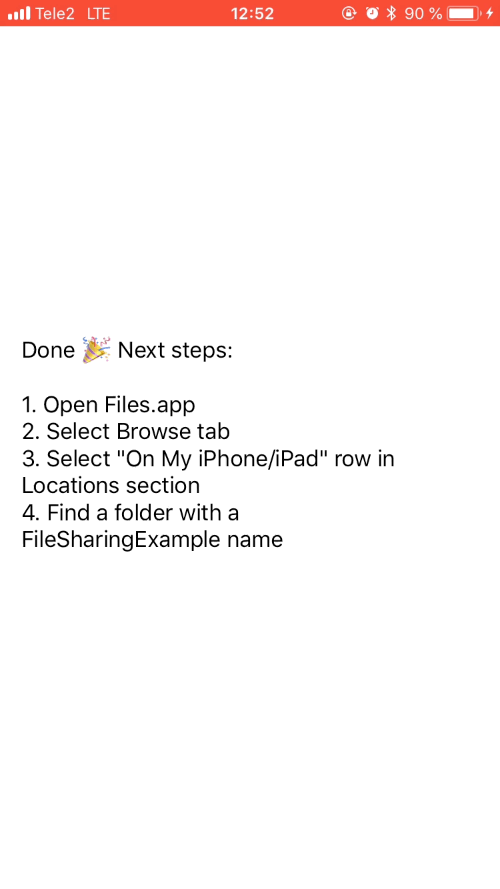

# File Sharing Example


Example project for Ole's [tweet](https://twitter.com/olebegemann/status/987346188591681536).

<p align="center">
    
</p>

## Information

The main goal of the tweet and this example is to simplify exploring Documents folder. Content of this folder can be available via Files.app if the app supports File Sharing. To enable this feature you should add these flags to `Info.plist`:
```
LSSupportsOpeningDocumentsInPlace=YES
UIFileSharingEnabled=YES
```
I implemented a Build Phase script for configuring these flags. The script adds it for Debug configuration and removes for Release configuration. That's it! The script is written in Swift by the way 😉.

## Author

Artem Novichkov, novichkoff93@gmail.com

[](https://www.codementor.io/artemnovichkov?utm_source=github&utm_medium=button&utm_term=artemnovichkov&utm_campaign=github)

## License

File Sharing Example is available under the MIT license. See the LICENSE file for more info.
